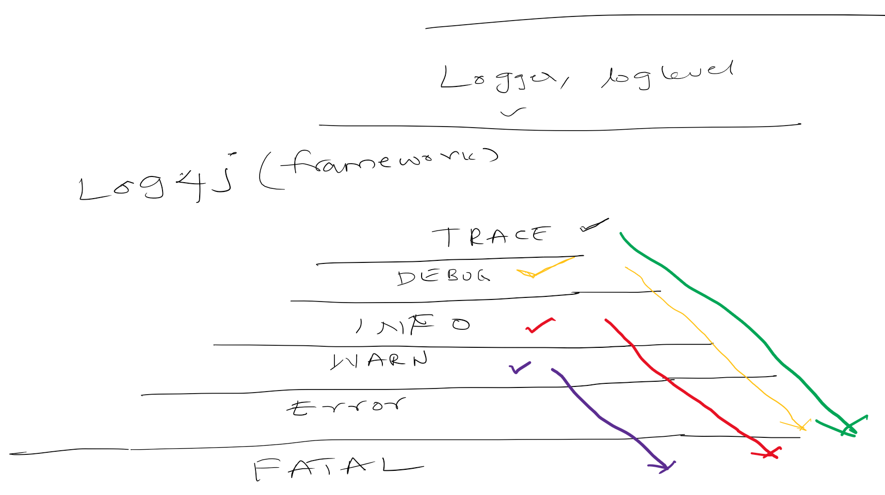

# Change Log level without restart of tomcat
In this tutorial we will change the log level of spring boot application during runtime. This doesnt require restart 
of application server (Tomcat)
- Enable Spring boot actuator endpoint
- Change log level using REST API
# Source Code 
    git clone https://github.com/balajich/change-log-level-without-restart-of-tomcat.git
# Video
[](https://www.youtube.com/watch?v=o2sXKa9W4OM)
- https://youtu.be/o2sXKa9W4OM
# Architecture

# Prerequisite
- JDK 1.8 or above
- Apache Maven 3.6.3 or above
# Clean and Build
    mvn clean install
# Running components
- Rest API instance 1: ``` java -jar .\restapi\target\restapi-0.0.1-SNAPSHOT.jar ``` 
- Rest API instance 2: ``` java -jar '-Dserver.port=9091' .\restapi\target\restapi-0.0.1-SNAPSHOT.jar ``` 
# Check Log level 
**Note I am running CURL on windows, if you have any issue. Please use postman client and collection is available 
at postman/change-log-level-without-restart-of-tomcat.postman_collection.json**
- Get all the configured log levels: ``` curl -s -L  http://localhost:8080/actuator/loggers ``` 
- Get the configured log level of ROOT: ``` curl -s -L  http://localhost:8080/actuator/loggers/ROOT ```
- Get the configured log level of package org.eduami.spring.logdemo.restapi : ``` curl -s -L  http://localhost:8080/actuator/loggers/org.eduami.spring.logdemo.restapi ```
# Change the log level
-  **This doesnt need restart of tomcat (application)**
- Change log level of root logger to TRACE:  ``` curl  -i -d '{\"configuredLevel\":\"TRACE\"}'  -H "Content-Type:application/json"  -X POST  http://localhost:8080/actuator/loggers/ROOT ```
- Access the application:  ``` curl http://localhost:8080/helloWorld and observe the logs are written in trace ```
- Change log level of root logger to ERROR: ``` curl  -i -d '{\"configuredLevel\":\"ERROR\"}'  -H "Content-Type:application/json"  -X POST  http://localhost:8080/actuator/loggers/ROOT ```
- Change log level of package org.eduami.spring.logdemo.restapi to TRACE: ```  curl  -i -d '{\"configuredLevel\":\"TRACE\"}'  -H "Content-Type:application/json"  -X POST  http://localhost:8080/actuator/loggers/org.eduami.spring.logdemo.restapi ```
# Code walk through
- Have spring actuator as dependency

```xml
        <dependency>
            <groupId>org.springframework.boot</groupId>
            <artifactId>spring-boot-starter-actuator</artifactId>
        </dependency>
```
- Enable actuator endpoints by default they are disabled

```yaml
management:
  endpoints:
    web:
      exposure:
        include: loggers
  endpoint:
    loggers:
      enabled: true
```